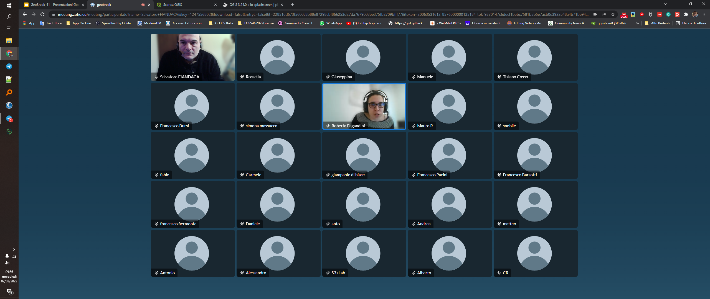
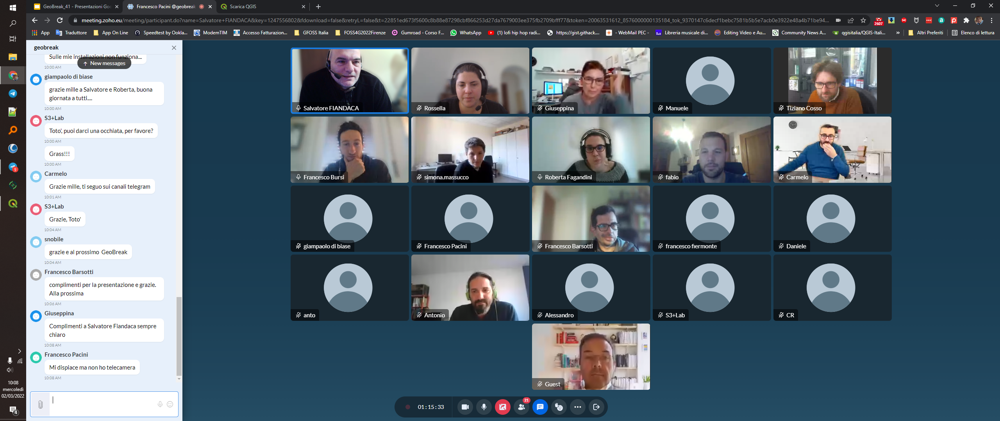

# GeoBreak 41 by Gter

GeoBreak 41 - **QGIS**: l'installazione!

[](https://github.com/pigreco/geobreak_41_by_Gter/discussions)

---

**INDICE**

<!-- TOC -->

- [GeoBreak 41 by Gter](#geobreak-41-by-gter)
  - [Relatore](#relatore)
  - [Data, luogo e durata](#data-luogo-e-durata)
  - [Piattaforme e Software](#piattaforme-e-software)
- [Programma](#programma)
- [Slide](#slide)
- [Contatti](#contatti)
  - [Salvatore Fiandaca](#salvatore-fiandaca)
  - [Sitografia](#sitografia)
- [Riferimenti utili](#riferimenti-utili)
- [Cosa c'è in questo repo](#cosa-cè-in-questo-repo)
- [risultati](#risultati)
  - [chat](#chat)

<!-- /TOC -->

---

**TITOLO**: <br> Installazione di [QGIS](https://qgis.org/it/site/): Standalone VS OSGeo4W Network Installer.

**DESCRIZIONE**: <br> QGIS non ha bisogno di presentazioni, chi opera nel campo dei GIS conosce le sue potenzialità, le sue funzioni e strumenti. Ma in quanti ci siamo chiesti: _quale versione scelgo_? _Standalone o OSGeo4W installer_? _Vecchio o nuovo repository_? _Versione LTR o ultima versione di sviluppo_? In questo GeoBreak ce ne parla **Salvatore Fiandaca**, che ci aiuterà a fare chiarezza sul primo e fondamentale passo verso un utilizzo più consapevole di **QGIS**: **l'installazione**!
<p align="center"><a href="https://www.gter.it/geobreak/" target="_blank"></a></p>

---

[](https://github.com/pigreco/seminario-estate-gis-2020/blob/master/license)
[](https://github.com/pigreco/seminario-estate-gis-2020/commits/master)

## Relatore

- **Totò FIANDACA** (aka pigreco) <br>(Membro [OpenDataSicilia](http://opendatasicilia.it/) (2014) | Membro [QGIS Italia](http://qgis.it/) (2015) | Socio [GFOSS.it](https://gfoss.it/) (2017) | Membro [QGIS organization](https://github.com/qgis) (2020) | Ideatore della Guida [#HfcQGIS](http://hfcqgis.opendatasicilia.it/it/latest/) (2018))

<p align="center"><a href="" target="_blank"></a></p>

## Data, luogo e durata

- 🗓 02/03/2022 con orario  🕟 09.00 🕢 10.00
- 🌐 on-line
- ⏳ una ora

## Piattaforme e Software

- [gotomeet](https://www.gotomeet.me/GTER1/geobreak) - per diretta web
- Windows 10 Pro 64b - come SO
- [`QGIS 3.24 RC Tisler`](https://qgis.org/it/site/)

<a href="https://changelog.qgis.org/en/qgis/version/3.24/"></a><br>
<a href="https://changelog.qgis.org/en/qgis/version/3.22/"></a>

<p align="center"><a href="" target="_blank"></a></p>

# Programma

1. introduzione da parte di GTER;
2. slide sull'argomento;
3. domande finali.

# Slide

[SLIDE](https://docs.google.com/presentation/d/e/2PACX-1vS2yLaIdI5a-PAnnxJKUOUVW70ro2wppuW2tp7RAfHgDsCIsGozNGoJ7_7lvp2HRcZYoMvGFTT_4Cws/pub?start=false&loop=false&delayms=3000)

[↑ torna su ↑](#geobreak-41-by-gter)

# Contatti

## Salvatore Fiandaca

* **Mail**: <pigrecoinfinito@gmail.com>
* **Facebook**: <https://www.facebook.com/pigreco314>
* **Twitter**: <https://twitter.com/totofiandaca>

## Sitografia

* **blog**: <https://pigrecoinfinito.com/>
* **canale youtube**: <http://www.youtube.com/c/TotòFiandaca>
* **HfcQGIS**: <https://hfcqgis.opendatasicilia.it/>
* **Tansignari**: <http://tansignari.opendatasicilia.it/it/latest/#>
* **data.world**: <https://data.world/pigrecoinfinito>
* **github**: <https://github.com/pigreco>
* **gitlab**: <https://gitlab.com/pigr3co>
* **Canale Telegram** : <https://t.me/pigrecoinfinito>

[↑ torna su ↑](#geobreak-41-by-gter)

# Riferimenti utili

- **Gter srl** : <https://www.gter.it/>
- **QGIS** : <https://qgis.org/it/site/>
- **Repo QGIS** : <https://github.com/qgis/QGIS/blob/master/README.md>
- **Font Trueno** : <https://www.wfonts.com/font/trueno>
- **Visual Style Guide** : <https://www.qgis.org/en/site/getinvolved/styleguide.html#trueno-fonts>
- **Visual Studio Code** : <https://code.visualstudio.com/>
- **OpenDataSicilia** : <http://opendatasicilia.it/>

[↑ torna su ↑](#geobreak-41-by-gter)

# Cosa c'è in questo repo

- cartella `imgs` contiene le immagini utilizzate nel progetto .qgs;
- file `license` è il file che definisce la licenza del repository;
- file `README.md` è questo file, con le info.

[↑ torna su ↑](#geobreak-41-by-gter)

# risultati

- presenti: numero massimo 30




## chat

```
giampaolo di biase : buongiorno a tutti....
Francesco Pacini : Buongiorno a tutti
simona.massucco : buongiorno :smile:
simona.massucco : scusate, avreste un link?
simona.massucco : di visdata, intendo
Daniele : Buongiorno a tutti/e
Francesco Bursi : In coda lo chiediamo a Salvatore :smile:
simona.massucco : :thumbsup:
francesco fiermonte : Buongiorno!!!
rocco pispico : ciao devo staccarmi. come sempre grazie per il buon inizio di giornata. grazie Totò grazie Roberta. solo una domanda Totò cosa hai usato per proiettare le slide? a presto
Roberta Fagandini : Ciao Rocco, grazie a te per essere stato con noi!
Roberta Fagandini : giro la domanda a Salvatore..
Francesco Bursi : https://github.com/pigreco/geobreack_41_by_Gter
Francesco Bursi : ci sono le slide sul suo repository
simona.massucco : un link per accedere al progetto (source, documentazione) :smile:
Carmelo : Buongiorno, una domanda per FIANDACA ..... quali sono i plugin assolutamente da avere installati su QGIS?
simona.massucco : riguardo la presentazione dell'11 marzo
Francesco Bursi : https://www.visidata.org/

sul canale di Salvatore penso ci siano anche dei tutorial e/o spunti
simona.massucco : grazie!
Mauro R : Grazie e arrivederci
Carmelo : URBANISTICA
S3+Lab : Qualcuno conosce il plugin "Servizi Ecosistemici Città di Torino" che dovrebbe aiutare nel "Calcolo dei Servizi Ecosistemici per la Città di Torino"?
S3+Lab : Sulle mie installazioni non funziona...
giampaolo di biase : grazie mille a Salvatore e Roberta, buona giornata a tutti....
S3+Lab : Toto', puoi darci una occhiata, per favore?
S3+Lab : Grass!!!
Carmelo : Grazie mille, ti seguo sui canali telegram
S3+Lab : Grazie, Toto'
snobile : grazie e al prossimo  GeoBreak
Francesco Barsotti : complimenti per la presentazione e grazie. Alla prossima
Giuseppina : Complimenti a Salvatore Fiandaca sempre chiaro
Francesco Pacini : Mi dispiace ma non ho telecamera
simona.massucco : complimenti a tutti, alla prossima!
S3+Lab : Sempre Grandi!!!
Francesco Pacini : Grazie a tutti. Complimenti Salvatore.
S3+Lab : Grazieeeee
Giuseppina : grazie a tutti
```

[↑ torna su ↑](#geobreak-41-by-gter)
