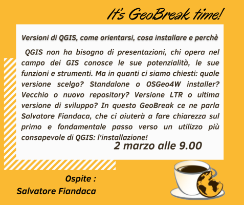
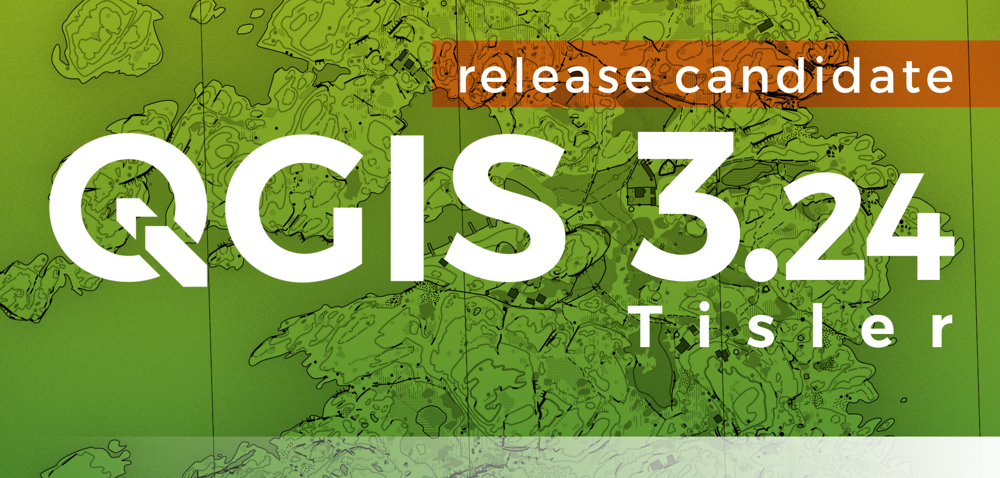

# GeoBreack 41 by Gter

GeoBreak 41 - **QGIS**: l'installazione!

---

**INDICE**

<!-- TOC -->

- [GeoBreack 41 by Gter](#geobreack-41-by-gter)
  - [Relatore](#relatore)
  - [Data, luogo e durata](#data-luogo-e-durata)
  - [Piattaforme e Software](#piattaforme-e-software)
- [Programma](#programma)
- [Slide](#slide)
- [Contatti](#contatti)
  - [Salvatore Fiandaca](#salvatore-fiandaca)
  - [Sitografia](#sitografia)
- [Riferimenti utili](#riferimenti-utili)
- [Cosa c'è in questo repo](#cosa-cè-in-questo-repo)
- [risultati](#risultati)

<!-- /TOC -->

---

**TITOLO**:   Installazione di [QGIS](https://qgis.org/it/site/): Standalone VS OSGeo4W Network Installer.

**DESCRIZIONE**:   QGIS non ha bisogno di presentazioni, chi opera nel campo dei GIS conosce le sue potenzialità, le sue funzioni e strumenti. Ma in quanti ci siamo chiesti: _quale versione scelgo_? _Standalone o OSGeo4W installer_? _Vecchio o nuovo repository_? _Versione LTR o ultima versione di sviluppo_? In questo GeoBreak ce ne parla **Salvatore Fiandaca**, che ci aiuterà a fare chiarezza sul primo e fondamentale passo verso un utilizzo più consapevole di **QGIS**: **l'installazione**!

---

## Relatore

- **Totò FIANDACA** (aka pigreco)  (Membro [OpenDataSicilia](http://opendatasicilia.it/) (2014) | Membro [QGIS Italia](http://qgis.it/) (2015) | Socio [GFOSS.it](https://gfoss.it/) (2017) | Membro [QGIS organization](https://github.com/qgis) (2020) | Ideatore della Guida [#HfcQGIS](http://hfcqgis.opendatasicilia.it/it/latest/) (2018))

## Data, luogo e durata

- 🗓 02/03/2022 con orario  🕟 09.00 🕢 10.00 
- 🌐 on-line
- ⏳ una ora

## Piattaforme e Software

- [gotomeet](https://www.gotomeet.me/GTER1/geobreak) - per diretta web
- Windows 10 Pro 64b - come SO
- [`QGIS 3.24 RC Tisler`](https://qgis.org/it/site/)

# Programma

1. introduzione da parte di GTER;
2. slide sull'argomento;
3. domande finali.

# Slide

[SLIDE](https://docs.google.com/presentation/d/e/2PACX-1vS2yLaIdI5a-PAnnxJKUOUVW70ro2wppuW2tp7RAfHgDsCIsGozNGoJ7_7lvp2HRcZYoMvGFTT_4Cws/pub?start=false&loop=false&delayms=3000)

[↑ torna su ↑](#geobreack-41-by-gter)

# Contatti

## Salvatore Fiandaca

* **Mail**: <pigrecoinfinito@gmail.com>
* **Facebook**: <https://www.facebook.com/pigreco314>
* **Twitter**: <https://twitter.com/totofiandaca>

## Sitografia

* **blog**: <https://pigrecoinfinito.com/>
* **canale youtube**: <http://www.youtube.com/c/TotòFiandaca>
* **HfcQGIS**: <https://hfcqgis.opendatasicilia.it/>
* **Tansignari**: <http://tansignari.opendatasicilia.it/it/latest/#>
* **data.world**: <https://data.world/pigrecoinfinito>
* **github**: <https://github.com/pigreco>
* **gitlab**: <https://gitlab.com/pigr3co>
* **Canale Telegram** : <https://t.me/pigrecoinfinito>

[↑ torna su ↑](#geobreack-41-by-gter)

# Riferimenti utili

- **Gter srl** : <https://www.gter.it/>
- **QGIS** : <https://qgis.org/it/site/>
- **Repo QGIS** : <https://github.com/qgis/QGIS/blob/master/README.md>
- **Font Trueno** : <https://www.wfonts.com/font/trueno>
- **Visual Style Guide** : <https://www.qgis.org/en/site/getinvolved/styleguide.html#trueno-fonts>
- **Visual Studio Code** : <https://code.visualstudio.com/>
- **OpenDataSicilia** : <http://opendatasicilia.it/>

[↑ torna su ↑](#geobreack-41-by-gter)

# Cosa c'è in questo repo

- cartella `imgs` contiene le immagini utilizzate nel progetto .qgs;
- file `license` è il file che definisce la licenza del repository;
- file `README.md` è questo file, con le info.

[↑ torna su ↑](#geobreack-41-by-gter)

# risultati

- present1: xx

[↑ torna su ↑](#geobreack-41-by-gter)
